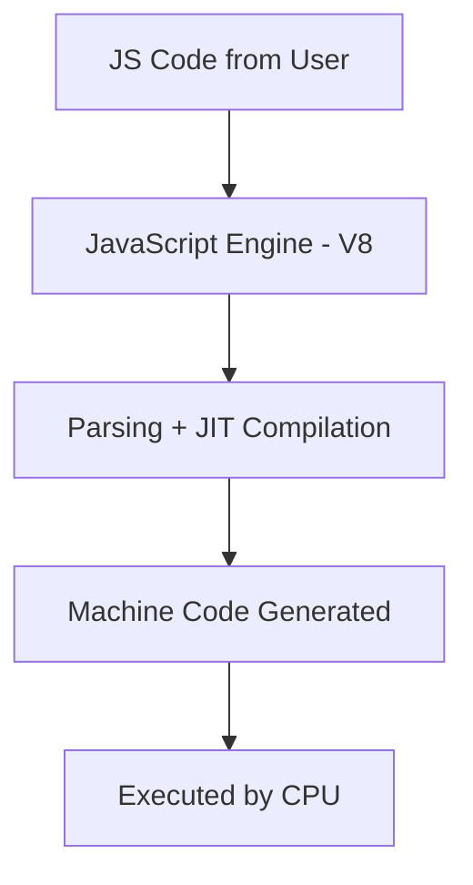
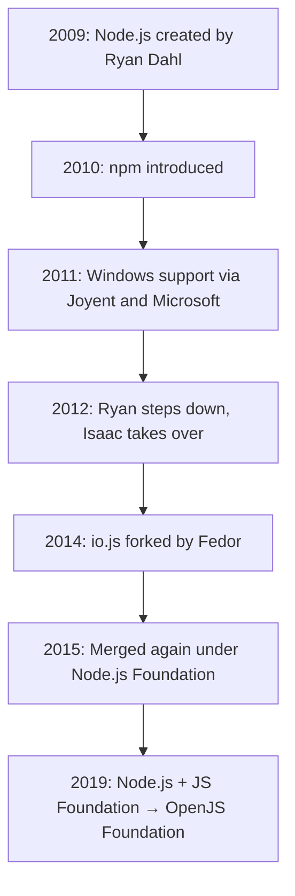

# 🟢 Node.js & JavaScript Execution – Complete Guide

---

## 📌 What is Node.js?

- **Node.js** is an open-source, cross-platform **JavaScript runtime environment**.
- It allows JavaScript to run **outside the browser**, especially on servers.
- Built on Google’s **V8 engine**, created by **Ryan Dahl** in **2009**.
- Maintained by the **OpenJS Foundation**.

---

## 🚀 Entering Node.js REPL Mode

- When you type `node` in the terminal and press Enter:
  - You enter **REPL mode** (Read–Evaluate–Print–Loop).
  - This allows you to **execute JS code interactively**, like using the browser console.

### ✅ To run a JavaScript file in Node(using terminal):
```bash
node filename.js
```

---

## 🌍 Global Object Differences

| Environment | Global Object      | `this` at Global Scope    |
|-------------|--------------------|----------------------------|
| Browser     | `window`           | `this === window` ✅       |
| Node.js     | `global`           | `this !== global` ❌ (it's empty) |

---

## 🔁 Evolution to `globalThis`

- In browsers, many names (like `window`, `self`, `frames`) all pointed to the global object.
- In Node.js, the global object is called `global`.
- To **unify global object access**, a new standard `globalThis` was introduced.
- `globalThis` is **universal** across all JS environments.

```js
console.log(globalThis); // always points to global object (browser or Node)
```

# 🧪 Node.js REPL, Global Object, and `globalThis` Explained

---

## ▶️ What Happens When You Type `node` in Terminal?

- Typing `node` in your terminal and pressing **Enter** launches **REPL mode**.

### 🔁 What is REPL?
- **REPL** = **Read - Evaluate - Print - Loop**
- It allows you to:
  - **Write JavaScript interactively**
  - See the output immediately
  - Test and debug code quickly, just like in the browser console

```bash
$ node
> 2 + 2
4
```

✅ This is why Node.js is called a **JavaScript runtime environment** — it allows JavaScript to run **outside** of a browser.

---

## 📄 Running a JavaScript File Using Node.js

To run a `.js` file:

```bash
node filename.js
```

Example:
```bash
node app.js
```

---

## 🌍 Global Object: Browser vs Node.js

| Environment | Global Object Name | `this` at Global Scope | Notes                                      |
|-------------|--------------------|-------------------------|--------------------------------------------|
| Browser     | `window`           | `this === window` ✅     | `window`, `self`, and `frames` are aliases |
| Node.js     | `global`           | `this !== global` ❌     | `this` is empty at the top level           |

---

## 🧠 Why So Many Names for the Global Object?

### 🧭 In the Browser:
- Early browsers named the global object as `window`.
- Later added:
  - `self` → used in **Web Workers**
  - `frames` → another alias
- All of them point to the **same global object**.

### 🖥️ In Node.js:
- The global object is called **`global`**, not `window`, `self`, or `frames`.

---

## 🔄 Why `globalThis` Was Introduced

- Developers were confused due to different global object names:
  - `window` in browser
  - `global` in Node
  - `self` in web workers
- A universal term was needed — but using a common name like `global` could break old code or conflict with variable names.

### ✅ The Solution: `globalThis`

- `globalThis` was introduced to provide a **universal reference** to the global object.
- Works in **all environments** (browser, Node, Deno, Workers, etc.)

```js
console.log(globalThis); // Always points to the global object
```

| Environment | Value of `globalThis` |
|-------------|------------------------|
| Browser     | `window`               |
| Node.js     | `global`               |
| Web Worker  | `self`                 |

> ✅ Use `globalThis` when writing **cross-platform JavaScript**.

---

## 🔚 Summary

- Typing `node` opens REPL: a live JavaScript environment in the terminal.
- `global` is Node's version of `window`.
- `this` behaves differently at the top level in Node.
- `globalThis` is now the **standard universal global object**, working everywhere.


---

## ⚙️ What Powers Node.js?

- Node.js = **V8 Engine** + **C++ APIs** + **Event Loop**
- V8: Compiles JS to fast native machine code
- APIs: Provide features like file system access, networking, etc.

---

## 🌐 What is ECMAScript?

- **ECMAScript** is the standard that defines **how JavaScript works**.
- Ensures consistency across engines like V8 (Chrome), SpiderMonkey (Firefox), JavaScriptCore (Safari).

---

## 🔁 JavaScript Execution Flow



---

## 🟡 Java vs 🟢 JavaScript Code Execution

| Feature        | Java                                                                 | JavaScript                              |
|----------------|----------------------------------------------------------------------|------------------------------------------|
| Compilation    | Source code → Bytecode (`.class`) → JVM → Machine code               | Source code → JIT Compilation → Machine code |
| Intermediate?  | Yes – uses `.class` bytecode                                          | No – directly compiled to machine code   |
| Runtime        | JVM                                                                  | JS Engine (e.g., V8)                     |

---

## 🧾 What is a Script?

- A **script** is a lightweight program, typically **interpreted**.
- Common for:
  - Automation tasks
  - Client-side web logic
- In JavaScript, even complex apps are still called scripts (historical naming).

---

## 🔄 Script vs Code vs Program

| Term     | Description                                                                 |
|----------|------------------------------------------------------------------------------|
| Script   | Short, interpreted logic (e.g., JavaScript, Python scripts)                 |
| Code     | Any written instructions in a programming language                          |
| Program  | A complete, executable software built from code/scripts                     |

---

## 👩‍💻 Coder vs Programmer vs Developer vs Engineer

| Title        | Description                                                                 |
|--------------|-----------------------------------------------------------------------------|
| Coder        | Writes basic code; focuses on syntax and logic                             |
| Programmer   | Builds working logic and features                                           |
| Developer    | Builds full apps; works with UI, backend, databases                        |
| Engineer     | Applies software engineering principles; system design & scalability       |

---

## 🕰️ Node.js Timeline



---

## 📦 npm – Node Package Manager

- Introduced in **2010**.
- Hosts over **2 million packages**.
- Used to install, manage, and publish Node.js libraries.

```bash
npm install express
```

---

## ✅ Key Takeaways

- Node.js enables **server-side JavaScript** using the V8 engine.
- **REPL mode** lets you test JS directly in the terminal.
- `globalThis` is the **universal global object** in any JS environment.
- Node.js is ideal for **APIs, real-time apps, and backend systems**.

---
