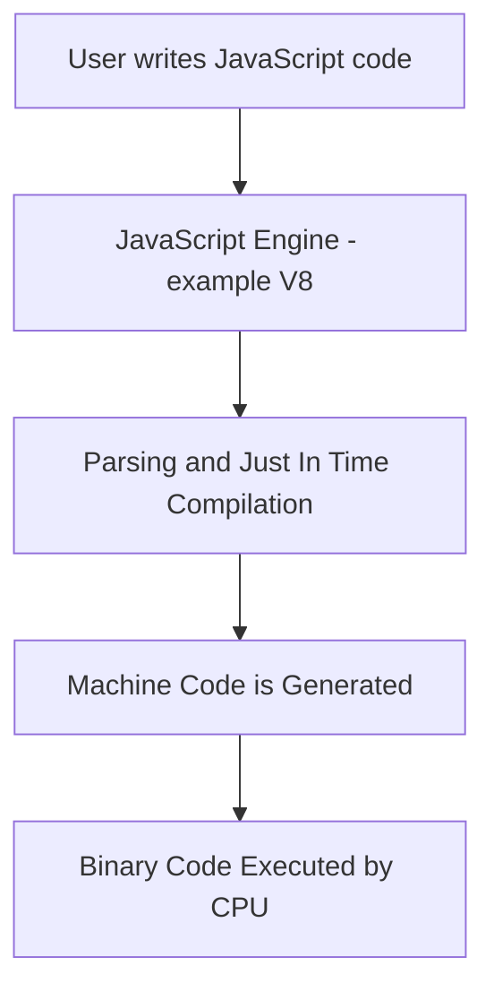

# 🟢 Node.js and JavaScript Execution Explained

## 📌 What is Node.js?

- **Node.js** allows you to run **JavaScript on the server-side**.
- A **server** is simply a **remote computer** that handles requests from clients.

## ⚙️ What's Inside Node.js?

- Node.js = **V8 JavaScript Engine** + **Additional APIs**  
  _(e.g., for file system access, timers, database operations, etc.)_

## 🔍 V8 Engine

- Developed by **Google** for **Chrome**.
- Its job is to **convert JavaScript code into machine code**.
- Written in **C++**.
- V8 can be **embedded in any C++ application** (e.g., Node.js, Deno, etc.).

---

## 🌐 What is ECMAScript?

- **ECMAScript** is the **standard specification** for scripting languages like **JavaScript**.
- It defines how the language should work so it's consistent across platforms and engines.

---

## 🚀 How JavaScript Code is Executed



---

## 🔄 Java vs JavaScript Code Execution

### 🟡 Java Execution Flow
```text
Java code → .class bytecode → JVM interprets → Machine code
```

- Java uses a **two-step** compilation process.
- The `.class` file (bytecode) is **platform-independent** and runs on the **Java Virtual Machine (JVM)**.

### 🟢 JavaScript Execution Flow
```text
JavaScript code → Parsed and JIT compiled → Machine code
```

- JavaScript is **Just-In-Time (JIT) compiled** directly into machine code by engines like **V8**.
- No intermediate `.class` or bytecode is created like in Java.

---

## 🧾 What is a Script?

- A **script** is a short, simple program, typically **interpreted** rather than compiled.
- Often used for:
  - Automation tasks
  - Lightweight workflows
  - Client-side logic (like in browsers)
- In JavaScript, even large applications are still called “scripts” due to historical convention.

---

## 🔄 Script vs Code vs Program

| **Term**  | **Meaning**                                                                 |
|-----------|------------------------------------------------------------------------------|
| Script    | Short, usually interpreted, lightweight logic (e.g., JS, Python scripts)     |
| Code      | Any written instructions in a programming language                           |
| Program   | A complete and executable software built using code or scripts               |

---

## 👩‍💻 Developer vs Programmer vs Coder vs Engineer

| **Title**    | **Description**                                                                 |
|--------------|----------------------------------------------------------------------------------|
| Coder        | Writes basic code; focuses on syntax and logic                                  |
| Programmer   | Writes and builds logic and functional modules                                  |
| Developer    | Builds complete applications; combines logic with UI, DB, and system integration|
| Engineer     | Applies engineering principles; focuses on scalability, system design, and architecture |

> ✅ These roles often overlap in practice, but differ in focus and scope.
